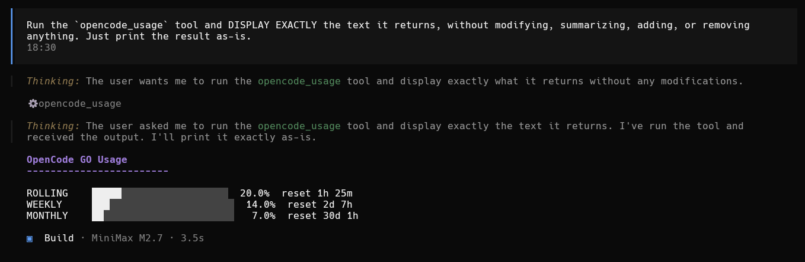
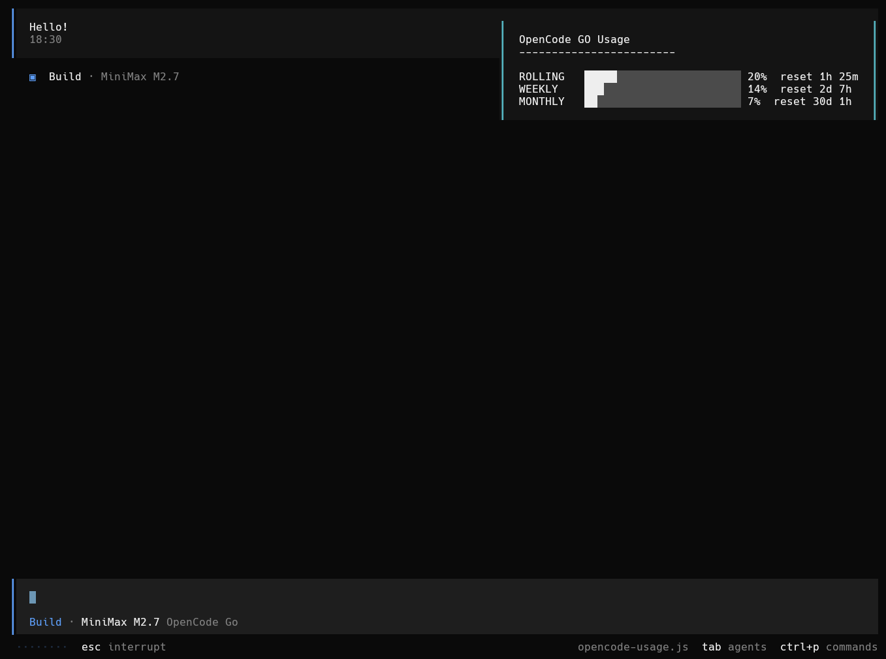

# opencode-usage-viewer

OpenCode Go plugin that displays token usage (rolling, weekly and monthly) in two ways:

1. **Tool** - Run `/usage` at any time to see current usage
2. **Automatic toast** - On session start, shows a toast with current usage

## Requirements

- OpenCode Go installed and configured
- Environment variables:
  - `OPENCODE_GO_WORKSPACE_ID` - Your workspace ID (found in the opencode URL)
  - `OPENCODE_GO_AUTH_COOKIE` - Authentication cookie (`auth` cookie from opencode.ai)

### How to get the variables

**WORKSPACE_ID**: Found in the URL when you access your workspace:
```
https://opencode.ai/workspace/[YOUR_ID_IS_HERE]/go
```

**AUTH_COOKIE**: You need to extract the `auth` cookie from your browser while logged into opencode.ai. In Chrome/Edge you can find it in DevTools > Application > Cookies.

## Installation

```bash
npm install -g opencode-usage-viewer
```

The postinstall script automatically adds `opencode-usage-viewer` to your global opencode config (`~/.config/opencode/opencode.json` or `opencode.jsonc`). After installing, restart opencode.

## How it works

### `/usage` Tool



```
> /usage

  OpenCode GO Usage
------------------------

ROLLING   ████████░░░░░░░░░░░░░░░░  33.0%  reset 6h 12m
WEEKLY    ██░░░░░░░░░░░░░░░░░░░░░░   8.0%  reset 3d 0h
MONTHLY   ░░░░░░░░░░░░░░░░░░░░░░░░   0.0%  reset 12d 0h
```

### Session Toast



When a session starts, a toast automatically appears showing:

```
OpenCode GO Usage
------------------------

ROLLING   ████████░░░░░░░░░░░░░░░░  33.0%  reset 6h 12m
WEEKLY    ██░░░░░░░░░░░░░░░░░░░░░░   8.0%  reset 3d 0h
MONTHLY   ░░░░░░░░░░░░░░░░░░░░░░░░   0.0%  reset 12d 0h
```

## Uninstall

```bash
npm uninstall -g opencode-usage-viewer
```

Also remove `opencode-usage-viewer` from the `plugin` array in your opencode config (`~/.config/opencode/opencode.json` or `opencode.jsonc`).

## Project structure

```
opencode-usage-viewer/
  index.js            # Main plugin (exports OpenCodeUsagePlugin)
  postinstall.js      # Adds plugin entry to opencode config
  package.json        # npm package config
  README.md           # This file
  screenshot-tool.png # Tool output screenshot
  screenshot-toast.png # Toast notification screenshot
```

## Troubleshooting

**Toast not appearing**
- Verify that environment variables are set
- Check opencode console for errors

**Tool not working**
- Make sure you are logged into opencode.ai
- Verify the `auth` cookie has not expired

**Fetch errors**
- May be a network issue or credentials problem